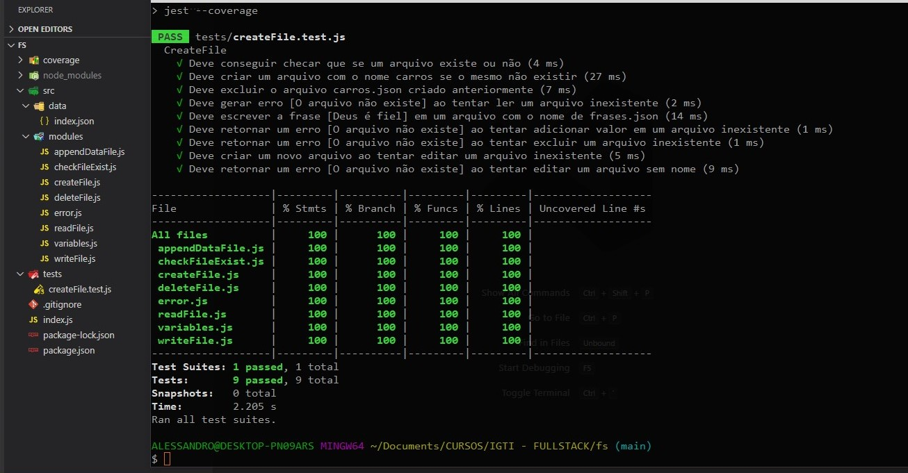

# Funções com File System

- Criar um novo arquivo json
- Escrever em um arquivo json
- Ler um arquivo json
- Excluir um arquivo
- Verificar se um arquivo existe

`$ git clone https://github.com/ALESSANDROLMENEZES/bootcamp-igti-fs.git`
`$ cd bootcamp-igti-fs`
`$ npm install`
`$ npm run test:cov`

